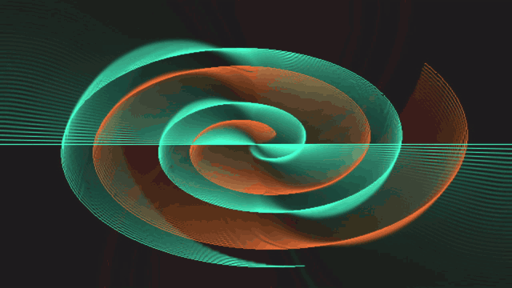
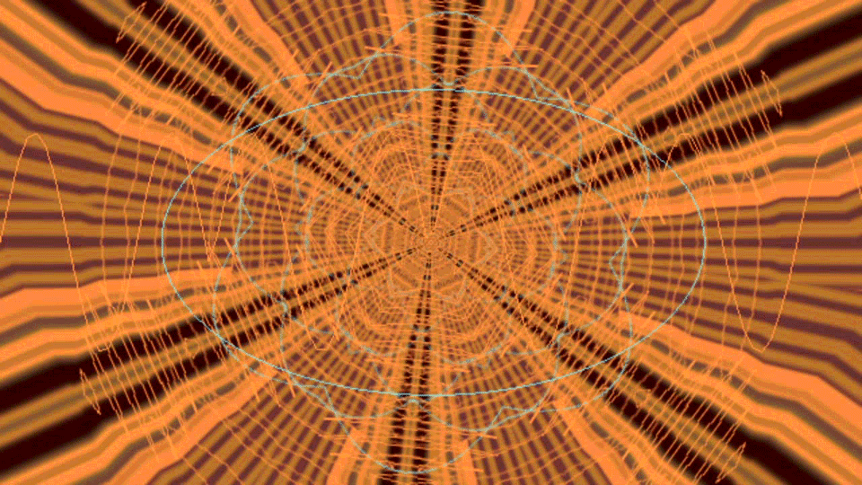
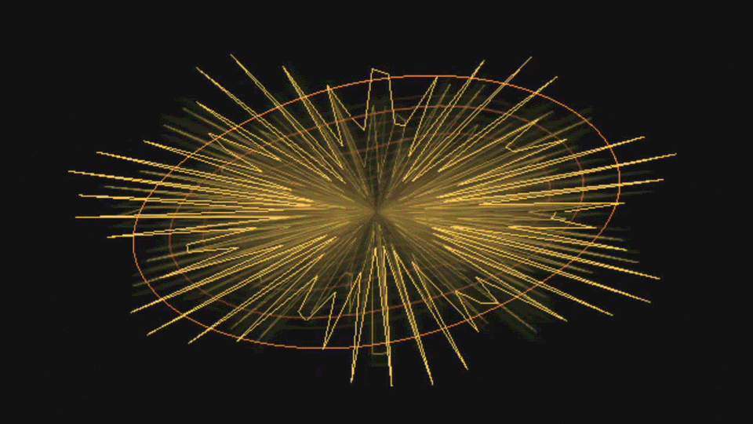
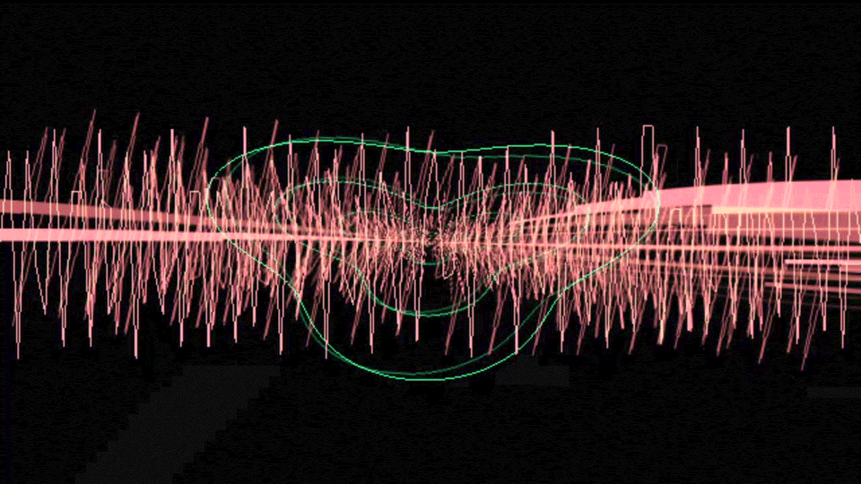
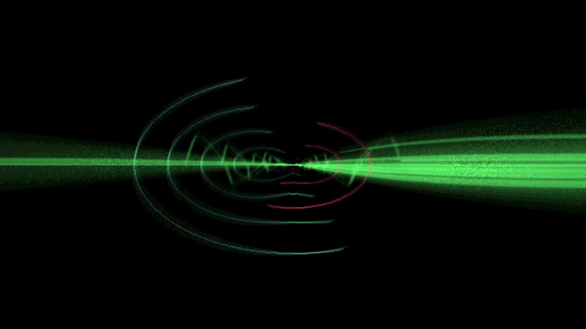

# EYESY MilkDrop

A MilkDrop-style music visualizer for the [Critter & Guitari
EYESY](https://www.critterandguitari.com/eyesy). It runs on the
[eyesy-platform](https://github.com/BrettKinny/eyesy-platform) engine, which
renders on the EYESY's own GPU. The pack holds one mode, `milkdrop`, that plays
a catalog of presets. Each preset is a few lines of MilkDrop-style equations,
kept in a Lua file, that drive MilkDrop's two-pass pipeline: a **warp** pass
moves and fades the previous frame, so everything leaves trails, and a
**composite** pass sets the colour and finish of what you see.



<sub>The `spirolateral` preset, captured from the EYESY's HDMI output, where it
runs at 29 fps.</sub>

> [!NOTE]
> **This is an unofficial project.** It is not affiliated with or endorsed by
> Critter & Guitari, or by MilkDrop's authors. Every preset here is written from
> scratch; no MilkDrop preset files are included.

| | |
| --- | --- |
|  |  |
| `kaleido-fold`, 33 fps | `painterly-flow`, 33 fps |
|  |  |
| `softmax-halo`, 32 fps | `roto-streaks`, 17 fps |

<sub>Captured from the EYESY's HDMI output, driven by its trigger test tone.
The frame rates were measured on the device at the same time.</sub>

## Quick start

You need the [eyesy-platform](https://github.com/BrettKinny/eyesy-platform)
engine first. Follow its [Run it on your
desktop](https://github.com/BrettKinny/eyesy-platform#run-it-on-your-desktop)
steps as far as `./eyesyctl build`. Then clone this repo next to it, so the two
folders sit side by side:

```sh
cd ..                     # the folder that holds eyesy-platform
git clone https://github.com/BrettKinny/eyesy-modes-milkdrop.git
cd eyesy-platform
./eyesyctl modes list     # should list milkdrop
./eyesyctl prepare-native
./eyesyctl preview milkdrop --native                # a window on your GPU
./eyesyctl preview milkdrop --headless --frames 120 # no window; saves the last frame in local/preview/grabs/
```

In the desktop preview, keys 1–5 select a knob and Up/Down turn it. Select
knob 2 and press Up/Down to step through the presets. Space is the trigger. The
platform README has [the full key
list](https://github.com/BrettKinny/eyesy-platform#run-it-on-your-desktop).

To put it on an EYESY, run `./eyesyctl modes sync` to copy the pack into the
platform's `modes/` folder, then build and deploy a release as the platform's
[Install on the EYESY](https://github.com/BrettKinny/eyesy-platform#install-on-the-eyesy)
section describes.

## Controls

| Control | What it does |
| --- | --- |
| Knob 1: motion | How fast each preset's clock runs, from 0.25× to 1.75× (1× at the centre). Every movement in a preset follows this clock |
| Knob 2: preset | Selects the preset. The knob's travel is divided evenly across the 24 slots, so the centre plays slot 13. A new slot always starts its preset fresh |
| Knob 3: detail | The number of points in each wave and sides in each shape, from 0.5× to 1.5× the preset's own value |
| Knob 4: hue | Shifts the whole picture's hue by up to 90° either way (no shift at the centre) |
| Knob 5: feedback | Scales how strongly each frame zooms and warps the last one, from 0.5× to 1.5× (1× at the centre). It has no effect on `reaction-field` |
| Trigger | Re-rolls the current preset's random choices, such as spin direction, wedge count and drift rates. Some presets also kick on it: `beat-pulse` flashes and `sphere-rush` bulges. It never changes the preset |
| Palette | Not used. Each preset makes its own colours |
| Persist | No effect. The mode always keeps its own trails |

The presets react to the bass, mid and treble levels of the audio input, and
the built-in wave draws the live waveform or spectrum.

A saved scene stores the preset slot and the preset's running state, so
recalling the scene brings the same preset back.

## Presets

Slots are numbered in the order the presets were added. A retired slot holds a
plain placeholder, so that saved scenes keep pointing at the right preset (see
[the append-only rule](#the-append-only-rule)).

| Slot | Preset | What you see | Device |
| --- | --- | --- | --- |
| 1 | `darken-drift` | A breathing line wave over slowly drifting, darkening trails | 34 fps |
| 2 | `retired-02` | Retired placeholder: a plain wave drift | |
| 3 | `zoom-drift` | The classic MilkDrop zoom: the trails pan, turn and zoom, and swell on hits | 35 fps |
| 4 | `rot-spin` | The whole frame spins and pulses, with a spoked wave marking the rotation | 37 fps |
| 5 | `warp-oscillation` | The trails ripple like liquid metal around a pinch point | 36 fps |
| 6 | `sphere-rush` | A fly-in tunnel: everything is pulled toward the centre | 37 fps |
| 7 | `retired-07` | Retired placeholder | |
| 8 | `q-bridge` | Colour, zoom and rotation drifting through a chain of linked variables; a demonstration preset | 35 fps |
| 9 | `custom-wave-ring` | A wobbling ring whose shape is re-rolled on each trigger | 31 fps |
| 10 | `custom-wave-petals` | A closed curve with 3- and 7-fold petals turning against each other | 35 fps |
| 11 | `built-in-spectrum` | Spectrum bars under a slowly orbiting frame | 37 fps |
| 12 | `beat-pulse` | Tight trails in loud passages, with a flash and zoom pop on each trigger | 35 fps |
| 13 | `flow-silk-warp` | Layered silk: every warp setting flows on its own audio-driven sine | not measured |
| 14 | `retired-14` | Retired placeholder | |
| 15 | `retired-15` | Retired placeholder | |
| 16 | `spirolateral` | Two counter-rotating spirals that bulge with the bass; looks good even in silence | 29 fps |
| 17 | `softmax-halo` | The frame blended with a rotated, enlarged copy of itself, so everything gets a halo | 32 fps |
| 18 | `plasma-veil` | A moving interference pattern veils one breathing ring | not measured |
| 19 | `kaleido-fold` | The frame folded into mirror-image wedges; the wedge count follows the bass | 33 fps |
| 20 | `roto-streaks` | Two arcs smeared into circular streaks around the centre | 17 fps |
| 21 | `painterly-flow` | Trails dragged and softened like wet paint; bass hits thicken the flow | 33 fps |
| 22 | `reaction-field` | A Gray-Scott reaction-diffusion pattern that grows out of the waves drawn into it | 40 fps |
| 23 | `starfield-drift` | 224 stars streaming out from the centre, with spectrum bars along the bottom | not measured |
| 24 | `retired-24` | Retired placeholder | |

The device column is frames per second on a CM3+ EYESY. The numbers for slots
16–22 were measured on the live HDMI output; those for slots 1–12 come from
earlier offscreen runs, converted from median frame time. The platform's target
is 30 fps. Most presets meet it; `roto-streaks` doesn't yet.
[Performance](docs/PERFORMANCE.md) has the exact numbers, how they were taken,
and what makes a preset expensive.

## Writing your own preset

Presets live in [`milkdrop/presets/presets.lua`](milkdrop/presets/presets.lua).
Each one is a Lua table of equations and settings:

```lua
{
  name = "my-preset",
  per_frame_init = "q1 = 0; q2 = 0.5 + 0.5*rand(1);",   -- on load and on each trigger
  per_frame = "q1 = q1 + 0.01 + 0.03*bass_att;"          -- every frame
    .. "zoom = 1.004 + 0.02*bass_att; rot = 0.05*q2*sin(q1);"
    .. "decay = 0.98; hue = 0.3*sin(q1*0.2);",
  per_pixel = "",
  warp_archetype = "default", comp_archetype = "default",
  warp_params = {}, comp_params = {},
  wave_mode = 0, wave_a = 0.8, wave_r = 0.6, wave_g = 0.9, wave_b = 1.0,
  waves = { { samples = 256, r = 1, g = 0.6, b = 0.3, a = 0.8,
              t1 = "th = sample*6.2832; x = 0.5 + 0.3*cos(th); y = 0.5 + 0.3*sin(th);" } },
  shapes = {},
  decay = 0.98,
  q = {},
}
```

- **Per-frame equations** read the audio (`bass`, `mid`, `treb` and their
  smoothed `_att` versions), the clock (`time`, `frame`) and 32 free variables
  (`q1`–`q32`). They write MilkDrop's motion and colour variables: `zoom`,
  `rot`, `warp`, `cx`, `cy`, `dx`, `dy`, `sx`, `sy`, `decay`, `gamma`, `hue`
  and more.
- **Wave equations** (`t1`) run once per point and set its `x` and `y`.
- **Archetypes** pick the warp and composite shaders: five warps (`default`,
  `sphere`, `kaleido`, `blur`, `diffuse`) and four composites (`default`,
  `softmax`, `plasma`, `rotoblur`).

The [preset format](docs/PRESET-FORMAT.md) lists every field, variable and
function. The easiest start is to copy an existing preset that's close to what
you want, append the copy at the end of the list, rename it, and change its
equations.

### The append-only rule

A saved scene remembers its preset by slot number. So **always add new presets
at the end of the list**, and never reorder or delete one. To retire a preset,
replace it with a placeholder that keeps its slot, as slots 2, 7, 14, 15 and 24
do. No check can catch a reordered catalog, so this rule is up to you and your
reviewer.

Before you share a preset, run the [checks](#checks), and try it on an EYESY if
you can: speed on your computer says nothing about speed on the device.
[Porting](docs/PORTING.md) covers where to find ideas, how to add a new shader,
and the licensing rule: port the idea of a MilkDrop look, never its preset
file.

## Checks

Run these from this repo's root. Each exits `0` on a pass, `1` on a failure,
and `2` when something it needs is missing, rather than quietly checking less.

| Command | What it checks | Needs |
| --- | --- | --- |
| `python3 tools/check_presets.py` | Every preset has the required fields and valid archetypes, every equation compiles, and 120 frames produce only finite numbers. Warns about variables that are read but never set | Python 3 and a Lua interpreter (`luajit`, `lua`, `lua5.1`, `lua5.3` or `lua5.4`) |
| `python3 tools/check_fragments.py` | Every shader follows the platform's shader rules, every uniform the mode sends a shader is declared by it, and the other way round | Python 3 and Lua |
| `python3 tools/check_render.py` | Compiles and renders each shader on a real OpenGL ES 2 driver, and checks that neutral settings leave the image unchanged | Python 3, Lua, a C compiler, and the EGL and GLES2 development files |
| `python3 -m unittest tests.test_milkdrop_evaluator` | The equation evaluator's arithmetic against an independent Python version, then every preset for finite output and on-screen waves | Python 3; the tests skip without Lua |

Two more commands prove that the checks themselves work, by breaking a copy of
the mode on purpose and confirming the check fails:
`python3 tools/check_fragments_negatives.py` and
`python3 tools/check_render.py --self-test`.

The [preset](docs/PRESET-CONTRACT.md), [fragment](docs/FRAGMENT-CONTRACT.md)
and [render](docs/RENDER-CONTRACT.md) contracts explain what each check
enforces, and what none of them can check: licensing, whether the look is any
good, and speed on the device.

## Layout

| Path | What it holds |
| --- | --- |
| `milkdrop/main.lua` | The mode: knobs, audio, preset loading and the warp → waves → composite pipeline |
| `milkdrop/lib/evaluator.lua` | The MilkDrop-style equation language |
| `milkdrop/presets/presets.lua` | The preset catalog |
| `milkdrop/frag/` | The 10 shaders: five warps, four composites and a blur |
| `tools/` | The checks |
| `tests/` | The evaluator's unit tests |
| `docs/` | The [preset format](docs/PRESET-FORMAT.md), [performance](docs/PERFORMANCE.md) and [porting](docs/PORTING.md) guides, the check contracts, and [research notes](docs/research/README.md) on MilkDrop's history and engines |

## Credits and licensing

This pack is released under the BSD 3-Clause License; see [LICENSE](LICENSE).

MilkDrop was created by Ryan Geiss at Nullsoft. Its engine lives on in
[MilkDrop3](https://github.com/milkdrop2077/MilkDrop3) by MilkDrop2077, which
builds on Maxim Volskiy's [BeatDrop](https://github.com/mvsoft74/BeatDrop). This
pack's pipeline follows MilkDrop 2's, and two of its shaders port MilkDrop 2's
default shaders, which are under BSD-3-Clause. Four more shaders port small
constructs from MIT-licensed projects. [THIRD_PARTY_NOTICES.md](THIRD_PARTY_NOTICES.md)
lists each one with its licence.

Every preset is an original set of equations written for this pack, based on
well-known MilkDrop looks described in the [research
notes](docs/research/README.md). No `.milk` preset file from MilkDrop or its
community has been copied.

## AI assistance

Much of the code and documentation here was written with AI coding assistants
(mainly Claude), working under the author's direction. The frame rates in this
README come from runs on a real EYESY, not from the assistants.

EYESY is a trademark of Critter & Guitari, Inc. It is used here only to name the
hardware this software runs on.
